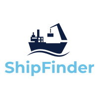

  

   A Voyage example app. Monitor your fleet of ships locations.

  
  

## Setup

Create a `.env` in the root from the `.env.example`

`npm i` inside root, client, and server directories

`docker-compose up` in the root of repo

`npm start` inside the client directory

## Application stack

- Node.js API
- React Front-End
- Postgres Database

## About Voyage

### Save 5 hours per week or more

Stop spending hours on environments for pull requests. Voyage does that for you. When you create a pull request, Voyage automatically generates an isolated environment and a unique URL you can send to the entire team. Get back to writing code and spend more time on the deep work that matters.

### Faster testing and review cycles

Requesting feedback shouldn’t be painful. Voyage makes it easy to gather and share feedback, even with non-technicals. Just send them a link, and reviewers can comment and submit screenshots directly, even without a Github account. No more screen sharing. No more awkward demos with, “This just worked a minute ago.”

### Setup in minutes. Save hours of time.

Your DevOps team should be improving your pipeline and infrastructure, not spinning up demo environments. Voyage takes just minutes to set up and won’t affect your existing code, pipeline or processes. Plus, you spend zero time on maintenance. Even an in-house tool can’t beat that!

[Try Voyage for free](https://voyageapp.io/pricing)
